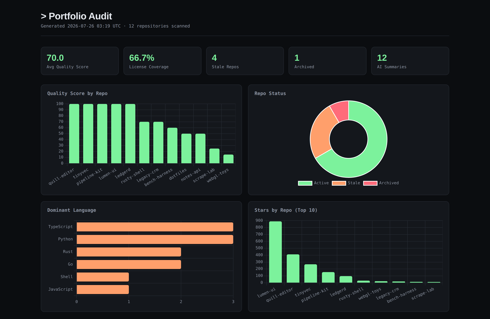

# Aletheia — portfolio auditor

**Proof, not vibes, for AI-built software.**

Aletheia scans your entire GitHub account, scores every repository, and tells
you exactly which ones need attention — the discovery stage of a three-tool
pipeline that ends in an evidence-backed truth badge on your README.

```bash
pip install -e .
export GITHUB_TOKEN=ghp_...
gha scan                          # discover every repo in your account
gha analyze                       # score them and build the HTML report
open reports/report.html
```



<sub>Generated from `examples/sample-portfolio.json` (sample data, not a real
account); summaries are real model output via `--provider openai`. Reproduce
it in one command with the [demo](#demo-no-github-token-needed) below.</sub>

## The pipeline

Aletheia is the front door to three standalone tools that answer three
different questions about a codebase:

```
 discover                triage                  verify
┌──────────────────┐    ┌──────────────────┐    ┌──────────────────────┐
│ portfolio auditor│ →  │    vibe-check    │ →  │   The Lie Detector   │ → badge
│ which repos need │    │ what's wrong     │    │ does the repo do     │
│ attention?       │    │ with this repo?  │    │ what its README says?│
└──────────────────┘    └──────────────────┘    └──────────────────────┘
  account-level           offline, free,          sandboxed execution,
  reports + scores        deterministic           receipt-backed verdicts
```

1. **Aletheia portfolio auditor** (this repo) — walks your whole account:
   repository discovery, per-repo quality scoring, AI summaries, and
   cross-repo insights, rendered as an HTML dashboard.
2. [**vibe-check**](https://github.com/holeyfield33-art/vibe-check) — a
   zero-dependency, offline scanner that flags the debt AI-assisted coding
   leaves behind (syntax errors, undeclared imports, typosquats, duplicated
   blocks, dead code) and emits a triage disposition: `FAST_TRACK`,
   `STANDARD_TRIAGE`, or `DEEP_AUDIT_REQUIRED`.
3. [**The Lie Detector**](https://github.com/holeyfield33-art/Lie-Detector) —
   extracts the factual claims from a README, turns each into a sandboxed
   pytest harness, executes it twice in a locked-down container, and
   adjudicates `PROVEN / FALSE / INCONCLUSIVE / UNTESTABLE` — producing an
   immutable verification receipt, an HTML Truth Report, and a
   [shields.io badge](https://github.com/holeyfield33-art/Lie-Detector#the-badge)
   anyone can independently re-verify.

The routing rule: run the auditor to find the repos worth polishing, run
vibe-check until a repo hits `FAST_TRACK`, then spend LLM time on the Lie
Detector to earn the badge. Every tool also works entirely on its own.

## Install

Requires **Python 3.11+**.

```bash
git clone https://github.com/holeyfield33-art/Aletheia-portfolio-auditor
cd Aletheia-portfolio-auditor

python3 -m venv .venv && source .venv/bin/activate
pip install -e .                    # auditor only
pip install -e ".[openai]"          # + OpenAI-compatible summary provider
pip install -e ".[dev]"             # + pytest
```

This installs two console scripts: `gha` (the auditor) and `aletheia` (the
pipeline front door).

## Credentials

| Variable | Required? | Used for |
|---|---|---|
| `GITHUB_TOKEN` | **yes**, for `scan` | Listing your repos. A classic PAT with `repo` (read) scope, or a fine-grained token with *Contents: read* and *Metadata: read*. |
| `ANTHROPIC_API_KEY` | optional | AI repo summaries with the default `anthropic` provider. |
| `OPENAI_API_KEY` / `FEATHERLESS_API_KEY` | optional | AI summaries with `--provider openai`. |
| `OPENAI_BASE_URL` | optional | Default for `--base-url` (OpenAI-compatible endpoints). |

Without an LLM key nothing breaks: summaries fall back to a plain
metadata sentence and are flagged in the JSON as `summary_is_ai: false`.

```bash
export GITHUB_TOKEN=ghp_...
export ANTHROPIC_API_KEY=sk-ant-...      # optional
```

## Run it — every command

### `gha scan` — discover

```bash
# Simplest: authenticated user, reads GITHUB_TOKEN from the environment
gha scan

# Explicit token instead of the env var
gha scan --token ghp_xxxxxxxxxxxx

# Somebody else's public repos
gha scan --username torvalds

# Write somewhere other than ./reports
gha scan --output ~/audits/2026-07

gha scan --help
```

| Option | Default | Notes |
|---|---|---|
| `--token` | `$GITHUB_TOKEN` | Required. Errors cleanly (exit 1) on a bad token. |
| `--username` | token owner | Any GitHub username; only public repos for other users. |
| `--output` | `reports` | Directory, created if missing. |
| `--incremental` | off | **No-op today** — accepted but not implemented. |

Writes `<output>/portfolio.json`. Responses are cached in `github_cache.sqlite`
in the working directory for 1 hour — delete it to force a fresh scan.

### `gha analyze` — score and report

```bash
# Simplest: reads reports/portfolio.json, writes reports/
gha analyze

# Non-default paths
gha analyze --input ~/audits/2026-07/portfolio.json --output ~/audits/2026-07

# Anthropic summaries with a specific model
gha analyze --model claude-haiku-4-5-20251001

# Any OpenAI-compatible endpoint (this exact invocation is verified working)
pip install -e ".[openai]"
export FEATHERLESS_API_KEY=rc_...
gha analyze --provider openai \
            --base-url https://api.featherless.ai/v1 \
            --model google/gemma-4-26B-A4B-it

# Force the no-AI path (deterministic, free, no network beyond the scan)
env -u ANTHROPIC_API_KEY gha analyze

gha analyze --help
```

| Option | Default | Notes |
|---|---|---|
| `--input` | `reports/portfolio.json` | Output of `gha scan`. |
| `--output` | `reports` | Directory for `analysis.json` + `report.html`. |
| `--provider` | `anthropic` | `anthropic` or `openai`. Anything else exits 1. |
| `--model` | provider default | `claude-haiku-4-5-20251001` / `gpt-4o-mini`. |
| `--base-url` | `$OPENAI_BASE_URL` | OpenAI-compatible endpoints only. |
| `--anthropic-key` | `$ANTHROPIC_API_KEY` | |

Writes `<output>/analysis.json` and `<output>/report.html`.

### `aletheia` — the whole pipeline

```bash
aletheia scan                                    # = gha scan
aletheia analyze                                 # = gha analyze
aletheia check ~/code/myrepo                     # triage with vibe-check
aletheia verify https://github.com/you/yourrepo  # Lie Detector run
```

`check` and `verify` are thin subprocess wrappers: they find `vibe-check` /
`liedetector` on your `PATH` (or `VIBE_CHECK_PATH`), pass every extra flag
straight through, and print install instructions and exit 2 if the tool is
missing. Installing the other two tools is optional — the auditor works
standalone.

### Exit codes

| Code | Meaning |
|---|---|
| 0 | Success |
| 1 | Bad token, GitHub API failure, missing/corrupt `portfolio.json`, unknown provider |
| 2 | `aletheia check` / `verify` — the external tool isn't installed |

## Demo (no GitHub token needed)

`examples/sample-portfolio.json` is a 12-repo synthetic account — a plausible
mix of healthy, stale, unlicensed and archived repos — shaped exactly like real
`gha scan` output. It exists so you can see the report before spending a token
on it, and so the screenshots above are reproducible:

```bash
pip install -e .
gha analyze --input examples/sample-portfolio.json --output reports/demo
open reports/demo/report.html            # xdg-open on Linux
```

Expected output:

```
✅ Phase 2 Analysis complete!
Avg quality score: 70.0 | License coverage: 66.7%
Stale repos: 4 | Archived: 1
Report: reports/demo/report.html
```

That run uses no LLM key, so `AI Summaries` reads `0` and every summary is the
metadata fallback. Add a key to get the AI path — 12 short calls, about 25
seconds:

```bash
export FEATHERLESS_API_KEY=rc_...
gha analyze --input examples/sample-portfolio.json --output reports/demo \
            --provider openai \
            --base-url https://api.featherless.ai/v1 \
            --model google/gemma-4-26B-A4B-it
```

That is how the screenshots above were made. See [docs/demo.md](docs/demo.md)
for a scripted walkthrough.

## What the report contains

- **Five headline stats** — average quality score, license coverage, stale
  count, archived count, number of genuinely AI-generated summaries.
- **Four charts** — quality score per repo, active/stale/archived split,
  dominant language distribution, top 10 by stars.
- **A per-repo table** — score, stars, summary, and the specific notes that
  explain the score (`No license file`, `Stale - no commits in 341 days`, …).

`report.html` is a **single self-contained file**: Chart.js is inlined and
there are no webfont, image or CDN requests, so it renders with no network
access. Email it, commit it, or open it on a plane.

### How the quality score works

Starts at 0, capped at 100:

| Signal | Points |
|---|---|
| Has a license | +20 |
| Has a description | +15 |
| Has topics/tags | +10 |
| More than one contributor | +15 (exactly one: +5) |
| At least one release | +10 |
| Pushed within 30 days | +20 (within 180 days: +10) |
| Not archived | +10 |

Repos with no push in 180 days are flagged **stale**.

## Auditor features

- Repository discovery and metadata (`gha scan`)
- Per-repo quality scoring (license, description, topics, contributors,
  releases, activity)
- One-sentence AI repo summaries (Anthropic by default, or any
  OpenAI-compatible endpoint via `--provider openai`, with a plain metadata
  fallback if no key is set)
- Cross-repo insights: license coverage, stale/archived repos, repos sharing
  a dominant language
- Self-contained HTML dashboard report, plus JSON output (`portfolio.json`,
  `analysis.json`) for your own tooling

Not yet implemented (do not rely on these): CI/CD or security analysis,
merge/dedupe suggestions, action-plan generation, PDF export, and incremental
(cache-based) scanning — the `--incremental` flag is currently a no-op.

### Read AI summaries as guesses, not findings

Summaries are generated from repo **metadata only** — name, description,
languages, topics. No source code is ever read. That has a consequence worth
knowing before you quote a summary at anyone:

> **When a repo has no description, the model infers one from the name and
> still writes it in a confident voice.**

In the sample report, `scrape-lab` has no description, no topics and no
README input, and the summary reads *"provides a Python-based tool for web
scraping and data extraction experiments."* That is a plausible guess from six
characters of repo name, presented as fact. It may well be wrong.

The scores and the notes column are computed from real metadata and are
trustworthy. The summary column is a convenience. Cross-check it against the
`No description` note in the same row — and if you need to know what a repo
actually does, that is what the other two tools in the pipeline are for.

## Troubleshooting

| Symptom | Fix |
|---|---|
| `Failed to fetch repositories: ... 401` | Token is invalid or expired. Regenerate the PAT. |
| `Failed to fetch repositories: ... 403` | Rate limit, or a network/proxy blocking `api.github.com`. |
| `... is not valid JSON` | `gha scan` was interrupted mid-write. Re-run `gha scan`. |
| `... is not a portfolio file` | `--input` points at something other than `gha scan` output. |
| Scan returns stale data | Delete `github_cache.sqlite` (1-hour response cache). |
| `openai SDK not installed` | `pip install -e ".[openai]"` |
| `vibe-check not found` | Install it, or `export VIBE_CHECK_PATH=/path/to/vibe_check.py` |

## Development

```bash
pip install -e ".[dev]"
pytest                       # 20 tests
pytest -q --tb=short
```

The `openai` provider test skips automatically if the `[openai]` extra isn't
installed, so both `[dev]` and `[dev,openai]` install paths are green.

See [docs/architecture.md](docs/architecture.md) for internals,
[docs/demo.md](docs/demo.md) for the demo script, and [AUDIT.md](AUDIT.md)
for the audit log.

## License

MIT. Vendored [Chart.js](https://www.chartjs.org/) v4.4.4 is also MIT.
